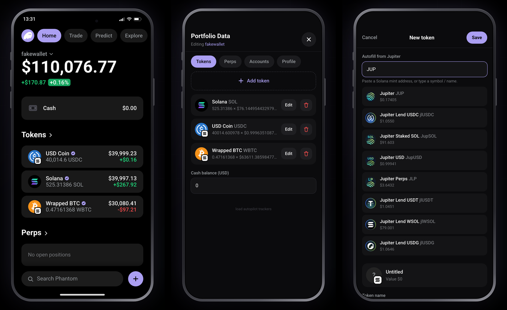
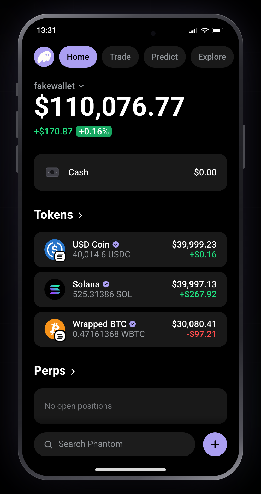
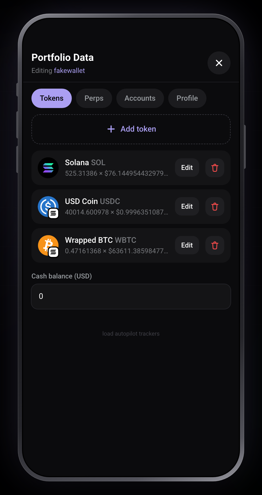
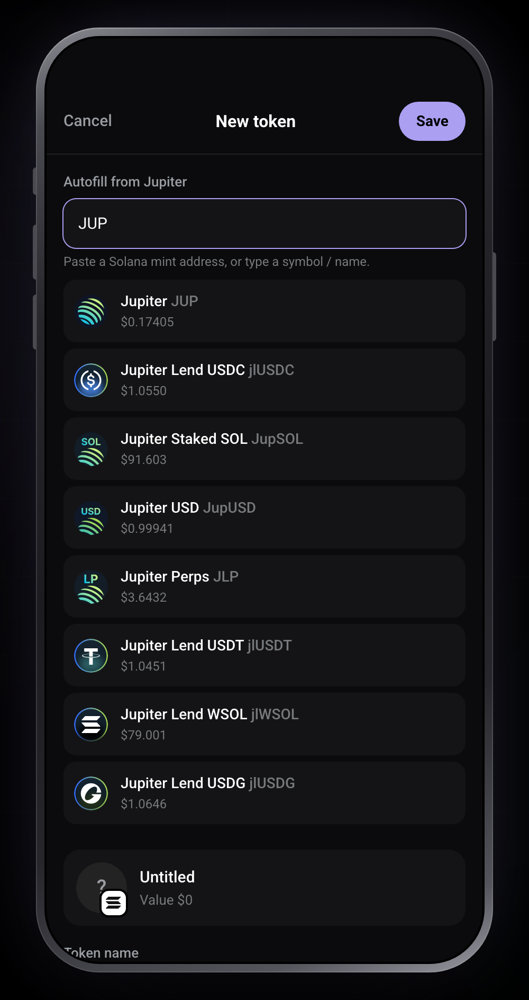
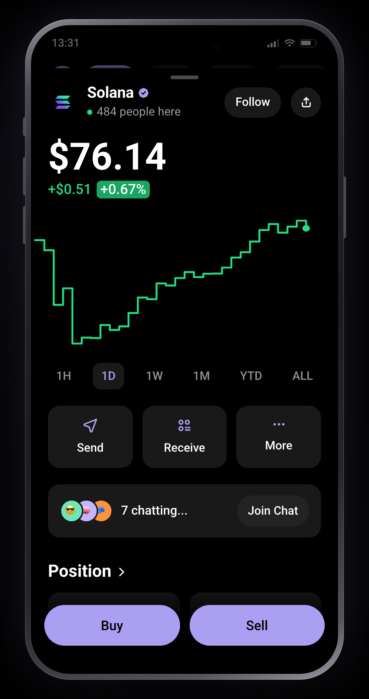
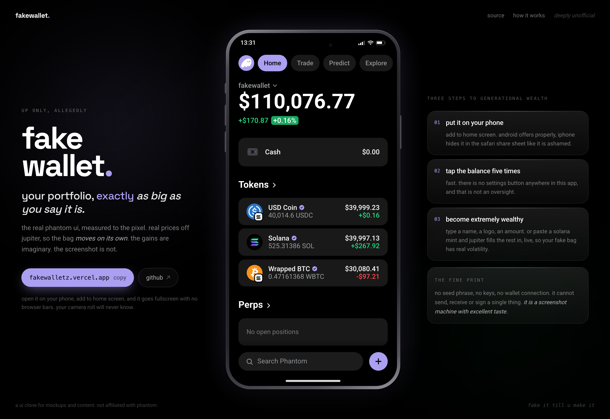

# fake-wallet

A fake Phantom wallet you can install on your phone.

**Live: https://fakewalletz.vercel.app**

This is a pixel matched clone of the Phantom wallet UI, measured screenshot by screenshot against the real app, running as an installable PWA. You open a hidden editor, type in whatever tokens and balances you want, and the home screen renders them exactly like the real thing. Same fonts, same spacing, same purple.

Token prices come live from the Jupiter API, so the portfolio ticks and the 24h numbers move on their own. Add it to your home screen and it opens fullscreen with no browser bars, so screen recordings look like the real app.

Frontend only. No wallet connection, no seed phrase, no private keys, no transactions. Just a UI with numbers you control.



## Screens

The wallet on a phone, the hidden editor, and adding a token straight from
Jupiter.

| home | the hidden editor | adding a token |
| --- | --- | --- |
|  |  |  |

Tapping a token opens the full detail screen, chart and all.



On a desktop browser the wallet moves into a phone and the space around it
becomes the landing page. On a phone you just get the wallet, fullscreen.



## How to change the balances

There is no visible settings button, on purpose. Two gestures open the editor:

**Tap the big balance number 5 times, fast** (within about 1.5 seconds)

or

**Tap the "Search Phantom" bar 5 times, fast** (works from any tab)

That opens a screen called **Portfolio Data** with four tabs.

### Tokens

Add, edit and delete the tokens on the account you are currently viewing, and set that account's Cash balance.

Each token has:

| Field | What it does |
| --- | --- |
| Token name | The big name on the row, like "Solana" |
| Symbol | The ticker under it, like "SOL" |
| Image URL | Any image link, it becomes the round logo |
| Quantity | How many you hold |
| Price (USD) | Price per token, ignored when live pricing is on |
| 24h change (%) | Drives the green or red number and the chart direction |
| Solana mint | Needed only if you want live pricing |
| Chain badge | The little white square on the logo corner |
| Live price from Jupiter | Toggle for real, moving prices |
| Verified badge | The purple check next to the name |

**Fastest way to add a token:** use the **Autofill from Jupiter** box at the top of the editor. Paste a Solana mint address, or just type a symbol like `JUP` or `BONK`. Pick a result and it fills in the name, symbol, logo, mint, price and 24h change in one tap, with live pricing already switched on. Then you only have to type the quantity.

**About the chain badge:** native tokens do not get one. SOL on Solana, ETH on Ethereum and POL on Polygon all show a plain logo with no badge. Set those to `none`. Wrapped and bridged tokens do get one, so USDC or WBTC sitting on Solana show the Solana badge. That is how the real app does it, and getting it wrong is the fastest way for a screenshot to look off.

### Autopilot trackers

There is a second button under "Add token" called **Load Autopilot trackers**. It drops in all nine tracker vaults from [autopilot-solana](https://autopilot-solana.vercel.app) at once, each priced in SOL and sized between 10k and 15k. Handy if that is the portfolio you keep rebuilding.

### Perps

Add positions to the Perps row: side (long or short), leverage, value, and PnL in dollars and percent.

### Accounts

Add, rename and delete accounts, give each one an emoji, and pick which one is active. These are the accounts in the "Your Accounts" sheet, reachable by tapping the account name under the balance.

### Profile

Set the username and avatar shown in the side drawer. Export your whole setup as JSON and import it on another device, so you do not have to type everything twice. There is also a reset button that puts the demo data back.

Everything is stored in your browser under `localStorage`, so it survives reloads and stays on your device. Nothing is uploaded anywhere.

## Prices

Two modes, set per token:

**Manual.** The price you typed. Values are just `price x quantity`, and the 24h delta comes from the change percentage you set. Use this when you want a number to stay exactly where you put it.

**Priced in SOL.** Fill in the "Price in SOL" field and the token is valued at that many SOL times the live SOL price. Good for vault shares and staked SOL, where the token tracks SOL rather than having its own market. The 24h number becomes SOL's move plus whatever alpha you set.

**Live from Jupiter.** Turn on the toggle and give the token a Solana mint. The app polls `lite-api.jup.ag/price/v3` every 30 seconds and whenever the window regains focus, and takes both the USD price and the real 24h change from it. Values drift with the market, which looks a lot more convincing on video than frozen numbers.

The default portfolio ships as roughly 40k in SOL, 40k in USDC and 30k in WBTC, all live priced, for a total around 110k.

## Add to home screen

If you open the site in a normal browser tab, a small bar appears above the search field offering to install it. On Android and desktop Chrome that fires the real install prompt. On iPhone, Safari has no install API, so tapping Add shows the actual steps instead: Share, then Add to Home Screen, then Add.

Once installed the bar disappears, because the app detects it is already running standalone.

One catch on iPhone: this only works in Safari. If you open the link from inside Instagram, Twitter or another in app browser, hit the menu and choose Open in Safari first, otherwise there is no Add to Home Screen option.

## Run it locally

```bash
npm install
npm run dev
```

Then open http://localhost:3000. The layout was measured against a 412 by 832 phone viewport, so use your browser's device toolbar for an accurate view. On desktop it centers itself at a max width of 520px.

```bash
npm run build
npm start
```

## Stack

Next.js 16 with the App Router, React 19, Tailwind CSS v4, TypeScript. No backend, no database, no state library. A small service worker caches the shell so the app installs properly and still opens with no connection, though prices obviously need one.

## How close is the clone

Sizes, spacing and colors were pulled out of real Phantom screenshots at 1206px wide, about 2.93x density, then converted to a 412px design width. Every landmark lands within roughly 1.5px of the original: 41px tab pills, 60px token rows on 18px gaps, 16px card corners, `#191919` cards, `#ea3336` change badge, `#ab9ff2` accent purple.

Screens included: home, the side drawer, the Your Accounts sheet, and the full token detail screen with its chart, time ranges, Send and Receive buttons, chat bar, Position grid and Native Stakes card.

## Notes

Unofficial and not affiliated with Phantom. This is a UI clone built for practice, mockups, demos and content. It cannot hold, send or receive anything, and it never asks for a seed phrase, because there is nothing for it to do with one.

Icons are Phantom's own, used to make the clone accurate.
